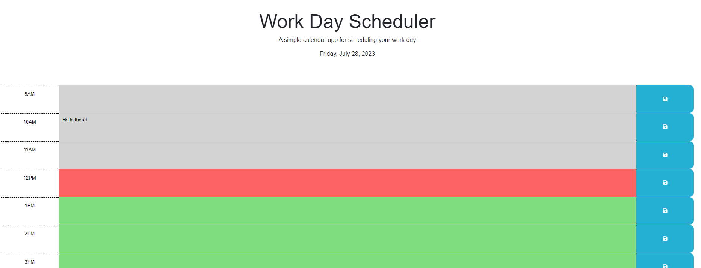

# Work Day Scheduler Starter Code

## Description

I created this work scheduler for the DU coding boot camp. This scheduler is made to keep up with tasks throughout the day in an easy way. The color of the hour is done so that past hours are grey, the current red, and future green. You can input tasks into any hour and save the task into local storage with the save button next to each hour. I learned about using DayJs to display date and time and using JQuery. I learned more about using "this" effectively.

## Usage
To use, open the live page. You'll see all the blocks for the hours of the work day displayed. To help you keep track of tasks, the color of the hour will change depending on if the hour is past, present, or future. The date on the header will change to reflect the current date. You can save tasks into local storage and they will be saved once you click the "save" icon button on the side. If the save was successful, a little message will be displayed at the top. If you revisit or refresh the page, the information will still be displayed. 

## Credits
Thank you to my professor, TAs and fellow students for teaching me along the way. Thank you to W3Schools, stack overflow, and MDN for great documentation as well as JQuery and DayJs.

Deployed Site: https://alester77.github.io/work-scheduler/

